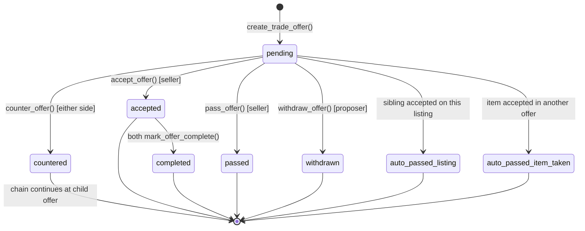
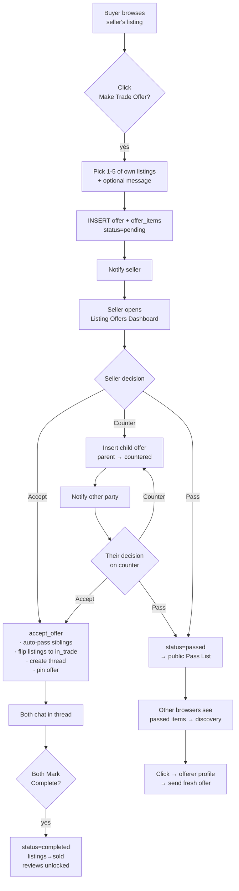

# Async Trade Offers — Design Spec

**Status:** Approved through brainstorming. Ready for implementation plan.
**Date:** 2026-04-26
**Author:** Brainstorming session (jintanakhomwong + Claude)
**Codebase:** tradehub-next (Next.js 16 + Supabase + React 19)

---

## 1. Summary

**Trade Offers** lets a buyer send a structured barter proposal — 1 to 5 of their own active listings + an optional message — to any seller's listing. The seller can **Accept**, **Counter**, or **Pass**. Counters spawn child offer rows linked by `parent_offer_id`. On Accept, the system auto-passes sibling offers and creates a chat thread with the offer pinned. Both parties hit **Mark as Completed** to close the trade and unlock reviews.

Every offer on a listing is publicly visible with the offerer's name (a "Craigslist-style" transparency choice), and passed offers move to a public **Pass List** that doubles as a reverse-discovery feed: anyone clicking a passed offer can view the offerer's profile and send *them* a fresh trade offer.

The feature ships on top of the existing `offers` table via a new `offer_type='trade'` discriminator (Approach C from brainstorming) — no parallel system, forward-compatible with cash + items hybrid in v2.

---

## 2. Goals & non-goals

**Goals (MVP)**
- Asynchronous, items-only trade offers with structured items (1–5 per offer).
- Public visibility of offers and passes for transparency and discovery.
- Seller workflow: Accept / Counter / Pass via a per-listing offers dashboard.
- Buyer workflow: Withdraw, view counter chains, accept counters back.
- Reverse discovery: passed offers expose the offerer's items as trade-bait.
- Atomic acceptance that auto-closes related offers and creates a thread.
- Both-sides completion handshake → unlocks the existing review system.

**Non-goals (v1 — explicitly deferred)**
- Cash + items hybrid offers (v2; schema is forward-compatible).
- 7-day pending offer expiry (v2).
- Item snapshotting at offer time (v2 — MVP shows live data with edited badge).
- AI matching / "best items to offer" suggestions (v3).
- Block lists, dispute escalation tied to trade offers (v2).
- Multi-side bundles where the seller adds their own items to a counter (v2).

---

## 3. Locked decisions

| # | Decision | Rationale |
|---|---|---|
| 1 | Items-only barter for MVP, cash later | Simplest scope; cash column already in table for forward compat |
| 2 | Up to 5 items per offer | Multi-item bundles matter; cap keeps UI manageable |
| 3 | Counters = new offer rows linked by `parent_offer_id` | Immutable rows, queryable timeline, easy audit |
| 4 | No item lockup; auto-decline siblings on accept | Buyers can shop one item to multiple listings; system resolves on accept |
| 5 | Auto-create thread on accept; both-sides Mark Complete unlocks reviews | Reuses existing thread/review systems |
| 6 | Approach C: single `offers` table with `offer_type` discriminator | Smallest migration; one unified system |
| 7 | Visibility = fully public + named (option A) | Maximum transparency, Craigslist style |
| 8 | "Reject"/"Decline" replaced with **"Pass"** everywhere | Softer, less confrontational copy |
| 9 | Passed offers go to a public **Pass List** on the listing | Discovery surface — failed offers become matchmaking signal |
| 10 | Pass List entry → click → offerer's profile → send fresh offer back | Reverse discovery flow |
| 11 | Listing-wide auto-pass on accept (not just item-overlap) | Avoids two simultaneous accepts |
| 12 | Per-listing **Listing Offers Dashboard** (notifications deep-link here) | Sellers see all offers on one listing side-by-side |

---

## 4. Naming

| Concept | Name |
|---|---|
| Feature (code, copy, URL) | **Trade Offers** |
| User-management surface | **Trade Inbox** (`/trades`) |
| Per-listing offers manager | **Listing Offers Dashboard** (`/listings/[id]/offers`) |
| Public list of passed offers | **Pass List** |
| Seller actions | **Accept**, **Counter**, **Pass** |
| Buyer actions | **Send Offer**, **Withdraw** |
| Completion handshake | **Mark as Completed** |

Reserve "Swap" for marketing copy only.

---

## 5. Scope

### 5.1 — MVP (v1)

- Send Trade Offer: pick 1–5 of own active listings + optional message
- Public Active Offers panel on every listing page (named, with offerer rating)
- Public Pass List on every listing page (named, with auto-pass badges)
- Listing Offers Dashboard for sellers
- Trade Inbox for users (sent / received-by-listing / in-progress / done)
- Counter offers via new offer row + `parent_offer_id`
- Buyer can Withdraw any pending offer
- Listing-wide auto-pass + item-overlap auto-pass on accept
- Auto-create thread on accept; pin offer in thread
- Both-sides Mark as Completed → unlocks reviews
- Reverse discovery from Pass List entry → offerer's profile → new offer
- Notifications via existing `notifications` table (7 new type values)
- Listings flip to new status `'in_trade'` between accept and complete

### 5.2 — v2 (quality of life)

- 7-day automatic expiry on pending offers (`auto_passed_expired`)
- Cash + items hybrid (`offer_type='hybrid'`)
- Pass List filters/sort, item value badges
- Item snapshotting at offer time
- Counter chain timeline with proper visualization
- "Hide my offers from public view" privacy opt-in
- Block list integration
- Drop deprecated `trade_description` column

### 5.3 — v3 (AI / smart matching)

- "Best items to offer for this listing" suggestions
- Trade fairness score
- Wanted-list ↔ Pass List automatic match notifications
- Trending trade pairs

---

## 6. User flow

### 6.1 — Happy path (step by step)

1. **Alice** posts her DSLR camera as a listing.
2. **Bob** browses, opens the camera listing page.
3. Bob sees public **Active Offers** panel + **Pass List** below the listing.
4. Bob clicks **Make Trade Offer**.
5. Modal lists Bob's own active listings; he selects bike + helmet (1–5 items).
6. Bob adds an optional message and submits.
7. System runs `create_trade_offer()`: inserts offer (`pending`) + offer_items, fires `trade_offer_received` notification to Alice.
8. Alice gets notification → taps it → lands on the **Listing Offers Dashboard** for her camera.
9. Alice sees Bob's offer at top with items, message, and Bob's rating. Three buttons: **Accept · Counter · Pass**.
10. Alice clicks **Accept** → `accept_offer()` runs atomically:
    - Bob's offer → `accepted`
    - Other pending offers on this listing → `auto_passed_listing`
    - Bob's other pending offers sharing bike or helmet → `auto_passed_item_taken`
    - Alice's listing + Bob's bike + helmet → status `'in_trade'`
    - Thread created (or reused) between Alice and Bob; offer pinned via `pinned_offer_id`
    - Notifications fired
11. Both Alice and Bob land in the chat thread; coordinate meetup.
12. Bob hits **Mark as Completed** (sets `completed_by_buyer = true`).
13. Alice hits **Mark as Completed** (sets `completed_by_seller = true`); status flips to `completed`. All listings flip from `'in_trade'` to `'sold'`.
14. `trade_offer_completed` notification → review forms unlock for both.

### 6.2 — Pass path
- Alice clicks **Pass** → `pass_offer()` sets status to `passed`.
- Offer appears in the public Pass List on the listing page.
- Bob receives `trade_offer_passed` notification.
- Other browsers see Bob's items in the Pass List; clicking opens Bob's profile; from there they can send Bob a fresh trade offer using their own items (reverse discovery).

### 6.3 — Counter path
- Alice clicks **Counter** → modal pre-fills with Bob's items; Alice adjusts the bundle she wants from Bob (only Bob's currently active listings appear).
- `counter_offer()` runs:
  - Bob's offer → `countered`
  - New offer row inserted with `parent_offer_id = bob_offer.id`, `proposer_id = alice.id`, items = Alice's adjusted list, status = `pending`
- Bob receives `trade_offer_countered` notification → can Accept / Counter / Pass on the chain.
- Either side can counter again. The chain alternates direction.
- At any moment exactly one link in the chain is `pending` (all earlier links are `countered`). Only the pending link can be accepted; accepting it finalizes the trade for the entire chain. (The earlier `countered` links stay in `countered` and serve as the negotiation history.)

### 6.4 — Concrete example

> Alice lists her *Canon DSLR*. Bob has 3 listings (bike, helmet, lock). Charlie has 2 (lens, tripod).
> 1. Bob offers bike + helmet for the camera. `pending`.
> 2. Charlie offers lens + tripod for the same camera. `pending`. Public Active Offers shows both.
> 3. Alice prefers Charlie's items but wants more — counters with "lens + tripod + your sunglasses." Charlie's original → `countered`; child offer (proposer=Alice) `pending`.
> 4. Charlie counters back with just lens + tripod (no sunglasses). Alice's counter → `countered`; new child (proposer=Charlie) `pending`.
> 5. Alice accepts. `accept_offer()` finalizes chain; Bob's offer → `auto_passed_listing`. Alice + Charlie's items flip to `'in_trade'`. Thread created.
> 6. Diane browses Alice's (now-traded) listing, sees Bob's bike in the Pass List, clicks Bob's profile, sends Bob a fresh trade offer for the bike.
> 7. Alice & Charlie meet, both Mark Complete. `completed`. Reviews unlocked.

---

## 7. Status state machine



**Status semantics:**

| Status | Visible in Pass List? | Final? |
|---|---|---|
| `pending` | No (in Active Offers) | No |
| `accepted` | No | No (awaiting completion) |
| `countered` | No | Soft-final (chain continues at child) |
| `passed` | **Yes** — "Passed by seller" | Yes |
| `auto_passed_listing` | **Yes** — "Listing already traded" | Yes |
| `auto_passed_item_taken` | No (items no longer available) | Yes |
| `withdrawn` | No | Yes |
| `completed` | No | Yes |

---

## 8. Database schema

One migration: `015_trade_offers.sql`. Two table changes (`offers` extension, new `offer_items`), one helper trigger fn, five stored functions, RLS updates.

### 8.1 — `offers` table changes

```sql
-- Drop old declined-only check; we have a richer status set now.
alter table offers drop constraint offers_status_check;

-- Migrate any existing 'declined' rows to 'passed' (no-rejection policy).
update offers set status = 'passed' where status = 'declined';

-- New columns
alter table offers
  add column offer_type      text not null default 'cash'
    check (offer_type in ('cash', 'trade')),
  add column proposer_id     uuid references profiles(id) on delete cascade,
  add column parent_offer_id uuid references offers(id)   on delete set null,
  add column updated_at      timestamptz not null default now(),
  add column completed_by_buyer  boolean not null default false,
  add column completed_by_seller boolean not null default false;

-- Backfill proposer_id for existing rows.
update offers set proposer_id = buyer_id where proposer_id is null;
alter table offers alter column proposer_id set not null;

-- Richer status set
alter table offers add constraint offers_status_check check (status in (
  'pending',
  'accepted',
  'countered',
  'passed',
  'auto_passed_listing',
  'auto_passed_item_taken',
  'withdrawn',
  'completed'
));

-- Helper trigger fn
create or replace function set_updated_at()
returns trigger as $$
begin
  new.updated_at := now();
  return new;
end;
$$ language plpgsql;

create trigger offers_set_updated_at
  before update on offers
  for each row execute function set_updated_at();

-- Indexes
create index idx_offers_parent          on offers(parent_offer_id);
create index idx_offers_proposer        on offers(proposer_id);
create index idx_offers_listing_status  on offers(listing_id, status);
```

**Column meaning post-migration:**

| Column | Role |
|---|---|
| `id` | Offer ID (one row per link in the chain) |
| `listing_id` | Listing being offered ON (constant across chain) |
| `buyer_id` | Non-owner participant — constant across chain |
| `proposer_id` | Sender of THIS offer (alternates with each counter) |
| `parent_offer_id` | NULL for original; previous offer for counters |
| `offer_type` | `'cash'` (legacy) or `'trade'` (this feature) |
| `status` | One of 8 states above |
| `message` | Optional message from proposer |
| `offer_amount` | Always 0 for `offer_type='trade'` (used in v2 for hybrid) |
| `trade_description` | Deprecated; ignored for trade offers; drop in v2 |
| `completed_by_buyer` | Set true when buyer hits Mark Complete |
| `completed_by_seller` | Set true when seller hits Mark Complete |

### 8.2 — New `offer_items` table

> **Note on `listing_id` meaning:** in `offers`, `listing_id` is the *seller's* listing (the thing being traded for). In `offer_items`, `listing_id` is one of the *buyer's* listings (the items being put up in the bundle). They reference the same `listings` table but play opposite roles.

```sql
create table offer_items (
  offer_id   uuid not null references offers(id)   on delete cascade,
  listing_id uuid not null references listings(id) on delete restrict,
  position   smallint not null default 0,
  created_at timestamptz not null default now(),
  primary key (offer_id, listing_id)
);

create index idx_offer_items_listing on offer_items(listing_id);

-- Cap of 5 items per offer
create or replace function enforce_offer_item_cap()
returns trigger as $$
begin
  if (select count(*) from offer_items where offer_id = new.offer_id) >= 5 then
    raise exception 'Trade offer cannot include more than 5 items';
  end if;
  return new;
end;
$$ language plpgsql;

create trigger offer_items_cap before insert on offer_items
  for each row execute function enforce_offer_item_cap();
```

**Behavior of `on delete restrict`:** if a buyer tries to delete a listing currently in a pending offer, the DB blocks it. UI surfaces a friendly message: *"Withdraw your pending offers first."*

### 8.3 — `listings` status extension

Add `'in_trade'` to the existing listings status check. **Preserve `'paused'`** — migration 008 added it for Stripe billing (paused when a pro subscription lapses) and the Stripe webhook actively reads/writes it. The full set after this migration is `active | sold | expired | paused | in_trade`.

```sql
alter table listings drop constraint if exists listings_status_check;
alter table listings add constraint listings_status_check
  check (status in ('active', 'sold', 'expired', 'paused', 'in_trade'));
```

Listings flip to `'in_trade'` when an offer involving them is `accepted`. They flip to `'sold'` when both sides Mark Complete. (Or back to `'active'` if the trade is later cancelled — out of scope for MVP.)

### 8.4 — `threads` extension

```sql
alter table threads
  add column pinned_offer_id uuid references offers(id) on delete set null;
```

`accept_offer()` populates this; the UI renders a pinned card from it.

### 8.5 — `notifications` type extension

```sql
alter table notifications drop constraint notifications_type_check;
alter table notifications add constraint notifications_type_check
  check (type in (
    -- existing
    'offer_received', 'offer_accepted', 'offer_declined', 'offer_countered',
    'new_message_thread', 'new_message', 'review_received',
    -- new (trade offers)
    'trade_offer_received',
    'trade_offer_countered',
    'trade_offer_accepted',
    'trade_offer_passed',
    'trade_offer_auto_passed',
    'trade_offer_withdrawn',
    'trade_offer_completed'
  ));
```

### 8.6 — RLS policies

> **🔴 Pre-deploy blocker — MUST resolve in Plan 2 before applying this migration to any remote database.**
>
> Dropping `"Offer participants can update offers"` is intentional — the new design routes ALL status changes through SECURITY DEFINER stored functions. However, `app/(main)/offers/page.tsx` (`handleUpdateOffer()`, lines 102–114) currently performs a direct client UPDATE on the existing cash-offer Accept/Decline flow. After this migration runs against a live database, that flow breaks (RLS rejects the UPDATE).
>
> **Plan 2 must replace that direct UPDATE with a server action calling `accept_offer()` (for "accepted") or `pass_offer()` (for "declined") before this migration is deployed.** Local development is unaffected.

```sql
-- Drop old participant-only read policy
drop policy "Offer participants can read offers" on offers;

-- Drop old participant-only update policy — all status changes go through
-- SECURITY DEFINER stored functions; clients never UPDATE offers directly.
drop policy "Offer participants can update offers" on offers;

-- New: trade offers public; cash offers participant-only
create policy "Trade offers public; cash offers participant-only"
  on offers for select using (
    offer_type = 'trade'
    or auth.uid() = buyer_id
    or auth.uid() = proposer_id
    or auth.uid() in (select user_id from listings where id = listing_id)
  );

-- Inserts: proposer must be the authenticated user
create policy "Authenticated users can create offers as proposer"
  on offers for insert with check (auth.uid() = proposer_id);

-- Direct UPDATEs blocked at policy level — all status changes go through stored functions.
-- (No update policy = no client-side updates allowed; SECURITY DEFINER functions bypass.)

-- offer_items inherit visibility from parent offer
create policy "Offer items follow parent offer visibility"
  on offer_items for select using (
    exists (
      select 1 from offers o
      where o.id = offer_items.offer_id
        and (o.offer_type = 'trade'
             or auth.uid() = o.buyer_id
             or auth.uid() = o.proposer_id
             or auth.uid() in (select user_id from listings where id = o.listing_id))
    )
  );

create policy "Proposer can add items to own pending offer"
  on offer_items for insert with check (
    exists (
      select 1 from offers
      where id = offer_id and proposer_id = auth.uid() and status = 'pending'
    )
  );
```

### 8.7 — Stored functions (atomic state transitions)

All five are `security definer` so they bypass RLS to run multi-row updates atomically.

| Function | Caller | Behavior |
|---|---|---|
| `create_trade_offer(listing_id uuid, item_ids uuid[], message text)` | Authenticated user | Validates: listing is `active` and not owned by caller; each item belongs to caller and is `active`; 1–5 item count. Inserts offer (`pending`, `offer_type='trade'`, `proposer_id=caller`, `buyer_id=caller`) + offer_items. Fires `trade_offer_received` notification to listing owner. Returns new offer_id. |
| `accept_offer(offer_id uuid)` | Listing owner only | Locks the offer row (`for update`); validates status=`pending`. Sets this offer `accepted`. Sets all sibling pending offers on this listing → `auto_passed_listing`. For each item in this offer, finds proposer's other pending offers containing the same item and sets them → `auto_passed_item_taken`. Flips involved listings to `'in_trade'`. Calls internal `_create_or_reuse_thread()` to populate `pinned_offer_id`. Fires notifications. |
| `counter_offer(parent_offer_id uuid, item_ids uuid[], message text)` | Receiver of the parent offer | Validates: parent status=`pending`, caller is the receiver, items belong to the *original buyer* and are `active`, 1–5 cap. Sets parent → `countered`. Inserts new offer row with `parent_offer_id`, `proposer_id=caller`, status=`pending`. Inserts offer_items. Fires `trade_offer_countered` notification to other party. Returns new offer_id. |
| `pass_offer(offer_id uuid)` | Listing owner only | Validates status=`pending`. Sets status=`passed`. Fires `trade_offer_passed` notification to buyer. |
| `withdraw_offer(offer_id uuid)` | Proposer of this offer | Validates status=`pending`. Sets status=`withdrawn`. Fires `trade_offer_withdrawn` notification to listing owner. |
| `mark_offer_complete(offer_id uuid)` | Either participant | Validates status=`accepted`. Sets the appropriate `completed_by_*` flag based on caller. If both flags now true: status=`completed`, flips all involved listings from `'in_trade'` to `'sold'`, fires `trade_offer_completed` notification to both. |

**Race condition protection:** `accept_offer()` opens with `select … from offers where id = $1 for update`. Concurrent accepts on overlapping items serialize; the second loses and returns a friendly error.

**Notification batching:** when `accept_offer()` auto-passes 3+ offers, batch into a single `trade_offer_auto_passed` notification per affected user with a count, not one per offer.

---

## 9. UI / UX screens

### 9.1 — Listing Detail Page (extend `app/(main)/listings/[id]/page.tsx`)

Two new public sections below the listing detail:
- **Active Offers panel** — pending trade offers, named, with offerer ratings.
- **Pass List panel** — passed + auto-passed offers, named, with reason badges.

New components in `components/offer/`:
- `ActiveOffersPanel.tsx`
- `PassListPanel.tsx`

### 9.2 — Make Trade Offer modal (`components/offer/MakeOfferModal.tsx`)

Triggered by `OfferButton.tsx` (extended with `offerType="trade"` mode). Shows a grid of the user's active listings with ≤5 selection cap, an optional message field (500 chars), and a "your offer is publicly visible" hint. Submit calls `create_trade_offer()`.

### 9.3 — Listing Offers Dashboard (`app/(main)/listings/[id]/offers/page.tsx`)

Per-listing seller view — every offer side-by-side. Three tabs: Active, Pass List, History. Each offer card shows items, message, offerer rating, action buttons (Accept/Counter/Pass), and a counter-chain timeline if the offer is part of one.

New components: `ListingOffersDashboard.tsx`, `OfferCard.tsx`, `CounterChainTimeline.tsx`.

### 9.4 — Trade Inbox (`app/(main)/trades/page.tsx`)

User's overall view. Four tabs: Sent, Received-by-listing, In Progress, Completed. Each row navigates to the relevant detail page.

New component: `TradeInbox.tsx`.

### 9.5 — Counter Modal (`components/offer/CounterOfferModal.tsx`)

Pre-fills with the previous offer's items. The picker only shows the *original buyer's* currently active listings. Submit calls `counter_offer()`.

### 9.6 — Trade Thread (extend `app/(main)/threads/[id]/page.tsx`)

If `threads.pinned_offer_id` is set, render `PinnedTradeCard.tsx` above messages. Card shows: traded items both sides, accept timestamp, two **Mark as Completed** checkboxes (one per party). When both flip, card switches to a "Trade completed — leave a review" CTA.

New components: `PinnedTradeCard.tsx`, `MarkCompleteButton.tsx`.

### 9.7 — Pass List discovery (interaction, no new screen)

Each Pass List entry navigates to `/users/[id]` (existing profile route). A new CTA button on profile pages — `SendTradeOfferToUserButton.tsx` — opens a 2-step picker: pick one of their listings, then your items. Reuses the same `MakeOfferModal`.

### 9.8 — Component & route map

```
components/
├── offer/
│   ├── ActiveOffersPanel.tsx
│   ├── PassListPanel.tsx
│   ├── MakeOfferModal.tsx
│   ├── ListingOffersDashboard.tsx
│   ├── OfferCard.tsx
│   ├── CounterChainTimeline.tsx
│   ├── CounterOfferModal.tsx
│   └── ItemPickerGrid.tsx        (shared)
├── trade/
│   ├── TradeInbox.tsx
│   ├── PinnedTradeCard.tsx
│   └── MarkCompleteButton.tsx
├── listing/
│   └── OfferButton.tsx           (existing, extended)
└── user/
    └── SendTradeOfferToUserButton.tsx

app/(main)/
├── listings/[id]/page.tsx        (extended — 9.1)
├── listings/[id]/offers/page.tsx (new — 9.3)
├── trades/page.tsx               (new — 9.4)
└── threads/[id]/page.tsx         (extended — 9.6)
```

---

## 10. Notifications

Reuses the existing `notifications` table (see 8.5). Real-time delivery already wired via `005_enable_realtime.sql`.

| Type | Recipient | Trigger | Deep link |
|---|---|---|---|
| `trade_offer_received` | Listing owner | `create_trade_offer()` | `/listings/:listing_id/offers` |
| `trade_offer_countered` | Other party | `counter_offer()` | `/trades/:offer_id` (or listing dashboard) |
| `trade_offer_accepted` | Buyer | `accept_offer()` | `/threads/:thread_id` |
| `trade_offer_passed` | Buyer | `pass_offer()` | `/listings/:listing_id` (with Pass List anchor) |
| `trade_offer_auto_passed` | Buyer | trigger / batch | `/trades/:offer_id` (with reason badge) |
| `trade_offer_withdrawn` | Listing owner | `withdraw_offer()` | `/listings/:listing_id/offers` |
| `trade_offer_completed` | Both | both Mark Complete | `/reviews/new?trade=:offer_id` |

**Rules:**
- Auto-pass batching: ≥3 auto-passes per recipient per second collapse into one notification with a count.
- Duplicate suppression: same `(user_id, type, link)` within 60 seconds is deduped.

---

## 11. Safety / anti-scam (MVP)

| Rule | Enforcement |
|---|---|
| No self-offers (`listing.user_id != auth.uid()`) | `create_trade_offer()` validation |
| Offered items must belong to proposer + `status='active'` | `create_trade_offer()` validation |
| Offered listing must be `status='active'` | `create_trade_offer()` validation |
| 5-item cap | DB trigger `enforce_offer_item_cap` |
| Rate limit: 5 trade offers/min, 20/day per user | Edge function or RLS-side count check |
| Listing deletion blocked while in pending offers | `on delete restrict` on `offer_items.listing_id` |
| Cross-cancel: cash accept also kills pending trade offers (and vice versa) | Extend `accept_offer()` to handle both `offer_type` values |
| Listing → `'sold'` or `'expired'` auto-passes pending offers | Trigger on `listings` UPDATE |
| Self-counter blocked (can't counter your own outbound offer) | `counter_offer()` validation |
| Status guards: only valid transitions per stored function | All functions check current status |
| Message ≤500 chars; optional profanity filter | UI + check constraint on `message` |
| Block lists | **Deferred to v2** |

---

## 12. Trust / rating system

Reuses existing `profiles` columns (`rating_avg`, `review_count`, `trust_score`, `response_rate`, `is_verified`).

| Signal | Effect |
|---|---|
| Completed trade | `+2` trust_score, prompts blind review (existing) |
| Manually passed quickly (<24h) | `+0.5` response_rate boost |
| Pending offer not responded to in 7 days | `-1` response_rate (v2 with expiry) |
| >3 withdrawals in 7 days | `-1` trust_score per excess withdrawal |
| `is_verified=true` | UI badge; small visual trust boost |
| `trust_score < 30` | UI warning banner on offer cards: "This user is new — meet in public, inspect items first." |

**Display rules:**
- Every offer card shows `★rating_avg` next to offerer name.
- Pass List shows the offerer's rating too.
- Numeric trust_score stays internal; only the warning badge surfaces it.

---

## 13. Edge cases & handling

| # | Edge case | Handling |
|---|---|---|
| 1 | Cash offer accepted while trade offer pending on same listing | Cash `accept_offer()` cross-cancels the trade offer |
| 2 | Listing expires/sold mid-pending-offer | Trigger on `listings` UPDATE auto-passes containing offers |
| 3 | Offerer edits their item after sending offer | MVP shows live data; UI adds "edited X ago" badge if `last_edited > offer.created_at` |
| 4 | Offerer's account deleted mid-trade | `on delete cascade` from profiles; thread shows "user no longer available" banner; status flips to `withdrawn` via trigger |
| 5 | Two simultaneous accepts on overlapping items | `select … for update` lock; second loses and gets `auto_passed_item_taken` |
| 6 | Counter loops indefinitely | No hard cap in MVP; timeline UI helps users see they're stuck. v2 may suggest "Pass" after 5+ rounds |
| 7 | Spam/harassment offers | Rate limits (5/min, 20/day). v2: block system + report-abuse on offer messages |
| 8 | Pass List entry points to a no-longer-active item | Pass List query filters out items whose listing isn't `'active'` |
| 9 | Notification storm (auto-pass cascade) | Batch ≥3 per user per second into one notification |
| 10 | Buyer offers a sold-but-not-deleted item | Function validates `status='active'`; UI greys out non-active listings |
| 11 | Empty offer (0 items) | UI requires ≥1 selection; `create_trade_offer()` fails with "must include at least 1 item" |
| 12 | Race: buyer withdraws while seller accepts | `update … where status='pending'` — first commit wins; loser sees "offer no longer available" toast |
| 13 | Offer chain spans listing being passed elsewhere | Each link references same `listing_id`; listing status triggers cascade across chain |

---

## 14. Big-picture system flow



---

## 15. Testing strategy

| Layer | Tooling | Coverage |
|---|---|---|
| **DB unit tests** | pgTAP or Supabase SQL test scripts | Each stored function: happy path + every rejection branch. RLS policies row-by-row. |
| **DB integration scenarios** | SQL transaction scripts | Full happy path; counter chain of 3 links; listing-wide auto-pass; item-overlap auto-pass; race condition (parallel `accept_offer` transactions); cross-type cancellation (cash accept vs trade pending) |
| **Server actions** | Vitest + Supabase test client | Wrappers around stored functions; error mapping to user-facing toasts |
| **Component tests** | Vitest + React Testing Library | `MakeOfferModal` validation (1–5 cap, message length); `OfferCard` action visibility per status; `CounterChainTimeline` rendering |
| **E2E** | Playwright | Bob → Alice → Accept → both Mark Complete → review prompt; counter chain (3+ links) ending in accept; Pass List discovery (Diane → Bob's profile → fresh offer) |
| **Manual QA checklist** | (markdown checklist in repo) | Notification deep-links; mobile layout for modals; copy strings ("Pass" never "Reject"/"Decline"); empty states; rate-limit messaging |

---

## 16. Implementation order (preview for the plan phase)

The implementation plan (next step — `writing-plans` skill) will sequence this. Rough order so the spec phase has a shape to it:

1. Migration `015_trade_offers.sql` (schema + functions + RLS) — DB tests pass.
2. Server actions in `lib/` calling the stored functions; error mapping.
3. Shared `ItemPickerGrid` + `MakeOfferModal`.
4. Listing page — `ActiveOffersPanel` + `PassListPanel`.
5. Listing Offers Dashboard + `OfferCard` + accept/counter/pass actions.
6. Counter modal + counter chain timeline.
7. Trade Inbox + sub-tabs.
8. Thread `PinnedTradeCard` + Mark Complete handshake.
9. Pass List discovery → profile CTA.
10. Notifications wiring + batching/dedup.
11. Rate limiting.
12. E2E tests + manual QA pass.

---

## 17. Open questions & future work

- **Item snapshotting** (v2): when (not if) we add it, items in offers should embed title/photo/condition at offer time so historical offers don't drift as items get edited.
- **Block list** (v2): no schema today. Add `blocks` table + integrate into `create_trade_offer()` validation.
- **Pending expiry** (v2): scheduled job that runs `auto_pass_expired_offers()` daily. Requires a new status value `auto_passed_expired`.
- **Hybrid offers** (v2): `offer_type='hybrid'` plus repurposing `offer_amount`. Most of this design is already forward-compatible.
- **Trade fairness signals** (v3): client-side estimate based on listing prices.
- **Multi-side bundles** (v2): allow seller to add their own items into a counter so it's "my X + my Y for your A + your B."
- **Dispute escalation** integration with the existing `dispute/` component folder — connect Mark Complete edge cases to the dispute flow.

---

*End of spec. Implementation plan to be drafted next via the `writing-plans` skill.*
